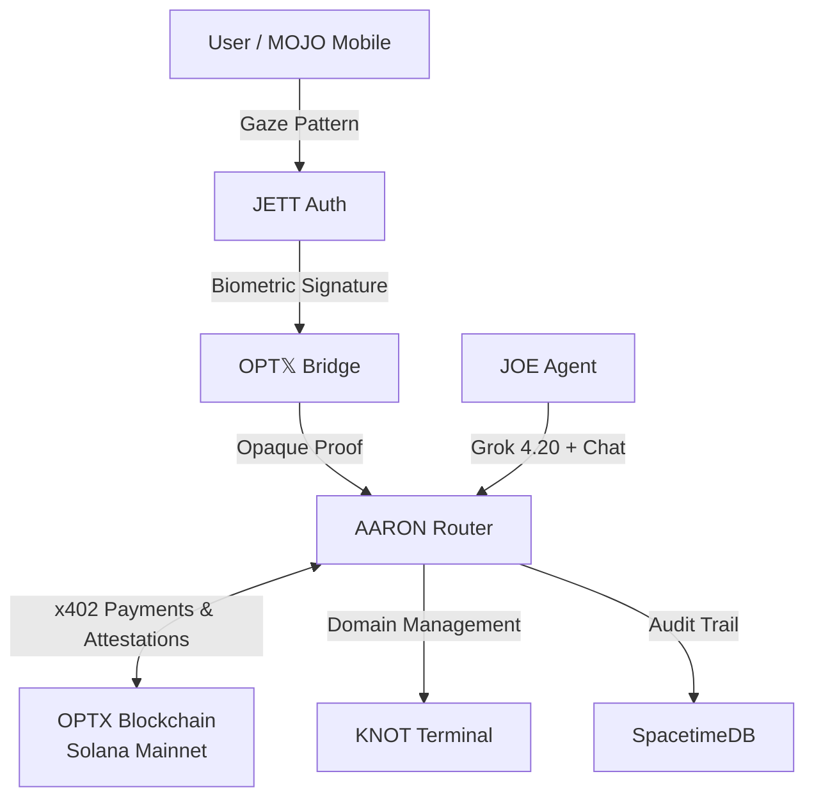

# Astro Knots — Spatial Encryption on Solana

_________________
AARON PROTOCOL
________________

[](https://explorer.solana.com/address/85sqs4upQiPrvk1NMuyfHVQoW1EGdgk8m2cQb7uMxXTF)
[](https://anchor-lang.com)
[](LICENSE)
[](.)
[](https://github.com/jettoptx/jettoptx-aaron-router)
[](https://app.meteora.ag/dlmm/54ecLhTa8HZg1bhcDNWiddd8p7UN7jq4HLWeLr1sRHMz)

## Live

- [jettoptics.ai](https://jettoptics.ai) — Main Site + DOJO + **Buy $JTX**
- [astroknots.space](https://astroknots.space) — Community Vault
- [astro.knots.sol](https://astroknots.space) — SNS V2 Domain
- [jett.vision](https://jett.vision) — JOEvision deeplink
- [astroknots.space/aaron](https://astroknots.space/aaron) — AARON Router API
- [docs.jettoptx.dev](https://docs.jettoptx.dev) — Developer Docs

---

## Programs

### Mainnet (live)

| Program | ID | Status | Explorer |
|---------|----|--------|----------|
| `jtx_optx_devnet_poa_trustjoe` (DePIN) | `85sqs4upQiPrvk1NMuyfHVQoW1EGdgk8m2cQb7uMxXTF` | ✅ Live | [view](https://explorer.solana.com/address/85sqs4upQiPrvk1NMuyfHVQoW1EGdgk8m2cQb7uMxXTF) |
| `jett_vault` | `JTX5uXTiZ1M3hJkjv5Cp5F8dr3Jc7nhJbQjCFmgEYA7` | ✅ Live | [view](https://explorer.solana.com/address/JTX5uXTiZ1M3hJkjv5Cp5F8dr3Jc7nhJbQjCFmgEYA7) |

### Devnet (testing — same code, separate keypair via `--features devnet`)

| Program | ID | Status |
|---------|----|--------|
| `jtx_optx_devnet_poa_trustjoe` | `79nQsecDspUWxvAMyJvK36EUty4yEoP5ssLvHZuNiugF` | ✅ Deployed |
| `jett_vault` | `FADKaMRVWdgsQXMhdBTLktdZqaEMA2VxmYcuhqhQ5SMC` (auth flipped 2026-05-02) | ✅ Deployed |
| `depin_program` (legacy) | `91SqPNGRFrTgwSM3S7grZK8A6TCqn5STFGK4mAfqWMbQ` | 🟡 Deprecated — superseded by mainnet `jtx_optx_devnet_poa_trustjoe` |

---

## Mainnet Trading

| Detail | Value |
|--------|-------|
| **$JTX mint** | `9XpJiKEYzq5yDo5pJzRfjSRMPL2yPfDQXgiN7uYtBhUj` (Token-2022) |
| **Mint authority** | ✅ **Revoked** — fixed supply forever |
| **Meteora DLMM pool** | `54ecLhTa8HZg1bhcDNWiddd8p7UN7jq4HLWeLr1sRHMz` |
| **Trading starts** | 2026-05-25 15:10 UTC |
| **Initial price** | 0.093524 SOL per JTX |
| **Seeded liquidity** | 6,000 JTX |
| **Bin step** | 25 bps |
| **LP lock** | 90 days via Meteora DLMM |
| **Treasury (tri-authority)** | `9WssADzftzptNnMHLzPZYAFApUfE7qLYChicH1Wh6YD7` |
| **Tempo agent wallet (EVM)** | `0xf35f4021ceb48672c6f804cd57973b0cbb2b6c3d` |
| **Buy / Track** | [jettoptics.ai/buy](https://jettoptics.ai/buy) |

---

## System Architecture



### End-to-End Flow

```
┌─────────────┐     ┌──────────────┐     ┌────────────┐     ┌──────────────┐
│ MOJO / Web  │────>│ JETT Auth    │────>│ AARON      │────>│ Solana       │
│ (Gaze Input)│     │ (AGT Tensor) │     │ (Edge Node)│     │ (Mainnet)    │
└─────────────┘     └──────────────┘     └────────────┘     └──────────────┘
      │                    │                    │                    │
      │  1. Iris capture   │                    │                    │
      │  2. COG/EMO/ENV    │                    │                    │
      │     classification │                    │                    │
      │                    │  3. Biometric hash │                    │
      │                    │  4. AGT projection │                    │
      │                    │                    │  5. Handshake tx   │
      │                    │                    │  6. Gaze attestation│
      │                    │                    │  7. Compute proof  │
      │                    │                    │  8. Finalize       │
      │                    │                    │                    │
      │                    │                    │  9. OPTX mint  ───>│
```

---

## Naming Hierarchy

| Name | Full | Role |
|------|------|------|
| **JETT Auth** | Joule Encryption Temporal Template Auth | Biometric gaze signature + SSO |
| **OPT𝕏** | Optical Program Technologic 𝕏tension | Secure bridge: JETT Auth → on-chain proofs |
| **AARON** | Asynchronous Audit RAG Optical Node | On-chain protocol + private edge router |
| **OPTX** | Public Blockchain & Token Network | Solana mainnet tokens and protocol |
| **AGT** | Agentive Gaze Tensor | COG/EMO/ENV tensors — performs Web4 actions for JETT Auth |
| **JOE** | jOSH Operating Environment | AI agent with Grok 4.20 vision + Matrix comms |

---

## Architecture Overview

The JTX-CSTB Trust Protocol uses AGT (Agentive Gaze Tensor) attestations with biometric proof hashing. The protocol combines gaze-based Proof-of-Attention with computational proofs to create verified human-compute attestations on-chain. `$JTX` holders can mint `$OPTX` through verified identity attestations.

### Key Concepts

- **Biometric proof hashing** — opaque 32-byte proofs computed client-side; only the hash is stored on-chain
- **AGT tensor math** — `w(t+1) = projection[(1 - alpha) * w(t) + alpha * g(t)]`
- **Simplex projection** — AGT weights live on the 2-simplex (COG + EMO + ENV = 1.0)
- **Dual-space key** — `k(t) = <w(t), s>` inner product with session seed
- **AARON audit** — immutable three-axis risk scoring (COG x ENV x EMO) with on-chain hash
- **Token-2022 standard** for all tokens
- **Non-custodial vault** with on-chain refund mechanism

### Protocol Flow

```
User Holds $JTX ------> Initiate Handshake
                                |
                    +-----------+-----------+
                    v                       v
          Submit Gaze Attestation   Submit Compute Proof
          (AGT tensor vectors)      (CSTB hash + difficulty)
                    |                       |
                    +-----------+-----------+
                                |
                                v
                      Finalize Attestation
                      (Create permanent record)
                                |
                                v
                    Combined Entropy ----> $OPTX Minting Allowance
```

---

## Token Ecosystem

| Token | Mint | Network | Purpose |
|-------|------|---------|---------|
| `$JTX` | `9XpJiKEYzq5yDo5pJzRfjSRMPL2yPfDQXgiN7uYtBhUj` | ✅ Mainnet | Governance + staking — mint revoked |
| `$OPTX` | `4r9WxVWBNMphYfSyGBuMFYRLsLEnzUNquJPnpFessXRH` | Devnet | Gaze attestation rewards (Token-2022) — mainnet TBD |
| `$CSTB` | `4waAimBGeubfVBp4MX9vRh7iTWxoR2RYYqiuChqCH7rX` | Devnet | DePIN validator token — mainnet TBD |

### $OPTX Minting Formula

```
optx_allowance = (gaze_entropy + compute_entropy) * difficulty * optx_per_entropy / 1000
```

### AARON Risk Gating

```
risk = (cog_risk * env_risk * emo_risk) / 10000
require!(risk <= 7500)  // 75% threshold for safe minting
```

---

## JTX Community Vault

| Detail | Value |
|--------|-------|
| **Goal** | 5,874 SOL (~$781K at $133/SOL) |
| **Phase 1 (2x OPTX)** | through August 31, 2026 |
| **Phase 2 (1x OPTX)** | September 1 – December 31, 2026 |
| **Refunds** | Enabled if goal not met by Phase 2 end |
| **Custody** | Non-custodial — full refund if goal not met |
| **Multisig** | 2-of-3 for emergency operations (Squads — in transition) |
| **Live at** | [astroknots.space](https://astroknots.space) |

### Subscription Tiers (Stripe direct + $JTX token gate)

| Tier | Price | JTX Required | OPTX Rate |
|------|-------|-------------|-----------|
| MOJO | $8.88/mo | 12 JTX (1 year) | 1x |
| DOJO | $28.88/6mo | 444 JTX (2 years) | 2x |
| Space Cowboy | $88.88/mo | 1,111 JTX (lifetime) | 3x |

---

## Protocol Instructions

### jtx_optx_devnet_poa_trustjoe (DePIN Trust Protocol)

| Instruction | Description |
|-------------|-------------|
| `initialize` | Initialize protocol with token mints and configuration |
| `update_config` | Authority updates protocol parameters |
| `create_user_entropy` | Create entropy tracking account for new user |
| `initiate_handshake` | Start new attestation handshake (1hr expiry) |
| `submit_gaze_attestation` | Submit AGT tensor proof (COG/EMO/ENV vectors) |
| `submit_compute_proof` | Submit computational proof (CSTB hash + difficulty) |
| `finalize_attestation` | Combine proofs, create permanent record, calculate OPTX allowance |
| `mint_optx` | Mint $OPTX tokens based on accumulated entropy |
| `verify_attestation` | Check if attestation is valid |
| `revoke_attestation` | Invalidate an attestation |
| `close_handshake` | Reclaim rent after expiry/completion |
| `set_paused` | Emergency pause protocol (authority only) |

### jett_vault (Community Vault + AGT)

| Instruction | Description |
|-------------|-------------|
| `initialize_vault` | Set goal, deadlines, multisig signers |
| `donate_sol` | Permissionless SOL donations |
| `donate_usdc_agent` | Agent USDC contributions (non-refundable) |
| `create_agt_attestation` | AGT tensor + biometric proof hash on-chain |
| `update_agt_weights` | Adaptive learning: `w(t+1) = proj[(1-a)*w(t) + a*g(t)]` |
| `link_attestation` | CPI to jtx_optx_devnet_poa_trustjoe for gaze verification |
| `aaron_audit` | AARON operator stamps immutable audit hash |
| `set_subscription` | MOJO / DOJO / Space Cowboy tier |
| `mint_optx` | Gated by subscription tier + AARON audit |
| `claim_refund` | Proportional SOL refund if goal missed |
| `set_paused` | 2-of-3 multisig emergency pause |
| `revoke_attestation` | Founder/AARON can revoke |
| `mint_donor_nft` | CPI to mpl-core CreateV2 — wallet-visible NFT receipt (B3.10) |

---

## Account Structures

### ProtocolConfig (PDA: `"protocol-config"`)

```rust
pub struct ProtocolConfig {
    pub authority: Pubkey,
    pub jtx_mint: Pubkey,
    pub cstb_mint: Pubkey,
    pub optx_mint: Pubkey,
    pub total_handshakes: u64,
    pub total_attestations: u64,
    pub total_optx_minted: u64,
    pub gaze_threshold: u64,
    pub compute_difficulty_min: u8,
    pub entropy_per_attestation: u64,
    pub optx_per_entropy: u64,
    pub paused: bool,
    pub bump: u8,
}
```

### Handshake (PDA: `"handshake" + user + handshake_id`)

```rust
pub struct Handshake {
    pub initiator: Pubkey,
    pub handshake_id: [u8; 32],
    pub expires_at: i64,
    pub gaze_verified: bool,
    pub gaze_tensor_hash: [u8; 32],
    pub cog_vector: [i16; 3],
    pub emo_vector: [i16; 3],
    pub env_vector: [i16; 3],
    pub gaze_entropy: u64,
    pub compute_verified: bool,
    pub compute_proof_hash: [u8; 32],
    pub difficulty_level: u8,
    pub compute_entropy: u64,
    pub finalized: bool,
    pub claimed: bool,
    pub bump: u8,
}
```

### AGT Attestation (jett_vault)

```rust
pub struct AgtAttestation {
    pub user: Pubkey,
    pub cog_weight: u32,       // Fixed-point 1e6
    pub emo_weight: u32,
    pub env_weight: u32,
    pub dual_key: u64,
    pub bilinear_score: u64,
    pub tensor_hash: [u8; 32],
    pub attestation_hash: [u8; 32],
    pub aaron_audit_hash: [u8; 32],  // Immutable once set
    pub risk_score: u16,             // Basis points (0-10000)
    pub subscription_tier: u8,
    pub revoked: bool,
    pub bump: u8,
}
```

---

## AGT Math

The Agentive Gaze Tensor maps iris gaze to three cognitive regions:

| Region | Zone | Description |
|--------|------|-------------|
| **COG** | Upper | Cognitive focus — analytical attention |
| **EMO** | Lower-left | Emotional processing — empathetic awareness |
| **ENV** | Lower-right | Environmental scanning — spatial awareness |

### Tensor Operations

```
// Simplex projection (weights sum to 1.0)
w = simplex_project(gaze_tensor)

// Adaptive update
w(t+1) = simplex_project[(1 - alpha) * w(t) + alpha * g(t)]

// Dual-space key
k(t) = inner_product(w(t), session_seed)

// Bilinear extension
B(w, g) = sum(w_i * g_i * phi_i)

// Tensor hash
hash = sha256(w[0] || w[1] || w[2] || dual_key)

// Attestation hash
attestation = sha256(tensor_hash || biometric_proof_hash)
```

### Entropy

Shannon entropy of the AGT weight distribution. Higher entropy (more varied gaze pattern) = stronger authentication signal.

---

## Development

### Prerequisites

- Rust 1.75+
- Solana CLI 1.18+
- Anchor 0.30.1+
- Node.js 18+

### Build

```bash
yarn install
anchor build -p jtx-optx-devnet-poa-trustjoe

# Mainnet build (default)
anchor build -p jtx-optx-devnet-poa-trustjoe
anchor build -p jett-vault

# Devnet build (uses separate program ID — see Cargo.toml `devnet` feature)
anchor build -p jett-vault -- --features devnet
```

### Test

```bash
anchor test
```

### Deploy

```bash
# Devnet
solana config set --url devnet
anchor deploy --provider.cluster devnet

# Mainnet (CAREFUL — coordinate with Squads multisig)
solana config set --url mainnet-beta
anchor deploy --provider.cluster mainnet-beta
```

---

## SDK

Three TypeScript modules for integration:

### JETT SDK (`sdk/jett-sdk.ts`)

Core utilities for working with the protocol:

```typescript
import { BiometricProof, AgtTensor, AaronRisk, JettAuth } from './sdk/jett-sdk'

// Create AGT tensor from gaze data
const tensor = AgtTensor.fromGaze(cogValue, envValue, emoValue)
const updated = tensor.update(observation, alpha)  // Adaptive learning

// Create a biometric proof (computed client-side, only hash goes on-chain)
const proof = BiometricProof.generate(tensor, entropy)
const proofHash = proof.hash()  // 32-byte opaque hash

// AARON risk assessment
const risk = AaronRisk.fromAxes(cogRisk, envRisk, emoRisk)
if (risk.isSafe()) {  // <= 75% threshold
  const auditHash = risk.computeAuditHash(attestationHash, timestamp)
}
```

### Trust Client (`sdk/trust-client.ts`)

Anchor program client for `jtx_optx_devnet_poa_trustjoe`. Handles handshakes, attestations, and OPTX minting.

### Vault Client (`sdk/vault-client.ts`)

Anchor program client for `jett_vault`. Handles vault deposits, AGT attestations, AARON audits, subscriptions, and refund logic.

---

## Security

### Verified Protections

- **Overflow protection** — all arithmetic uses `checked_add/sub/mul` with u128 intermediates
- **Double-mint prevention** — allowance deducted BEFORE CPI transfer
- **Double-finalization guard** — `finalized` flag prevents re-processing
- **Replay attack protection** — `claimed` flag on handshakes
- **Entropy overflow caps** — max 1 billion per attestation
- **Emergency pause** — `set_paused` (authority for trust, 2-of-3 multisig for vault)
- **Reentrancy guards** — Anchor default account validation
- **CPI security** — validates all program IDs in cross-program invocations
- **Biometric privacy** — proofs are opaque 32-byte hashes; raw data never leaves client
- **AARON immutability** — audit hashes cannot be modified once written
- **No private keys** in repository
- **Admin operations** gated by founder wallet
- **`aaron_operator` enforcement** — must be in `vault_config.multisig_signers` (B3.9)
- **Helius RPC** read from env vars instead of hardcoded literals

### Audit History

- **v2.0.0** (2026-01-30) — HEDGEHOG MCP security audit (Grok 4.1 Fast Reasoning)
- **v2.1.0** (2026-02-24) — Program ID alignment, SDK update, pre-mainnet review
- **v2.1.1** (2026-05-17) — RPC creds moved to env, smoke-test scripts (B3.10)
- **v2.1.2** (2026-05-23) — Mainnet deployment + treasury hardcoded tri-authority

---

## Mainnet Checklist

- [x] `jtx_optx_devnet_poa_trustjoe` deployed to mainnet (`85sqs4u...XTF`)
- [x] `jett_vault` deployed to mainnet (`JTX5uXTi...EYA7`)
- [x] $JTX mint live + mint authority revoked
- [x] Meteora DLMM pool created + seeded (`54ecLhTa...sRHMz`)
- [x] LP locked 90 days
- [x] Treasury wallet (`9WssA...YD7`) hardcoded tri-authority (JOE + Founder + Treasury)
- [x] Tempo agent wallet (EVM) configured for x402 settlement
- [x] Security audit v2.0.0 (overflow, replay, double-mint)
- [x] Security audit v2.1.1 (RPC creds + B3 smoke tests)
- [x] Security audit v2.1.2 (mainnet review)
- [x] Program ID alignment (Anchor.toml + SDK + scripts)
- [x] TypeScript SDK (jett-sdk, trust-client, vault-client)
- [x] AARON Router live ([jettoptx-aaron-router](https://github.com/jettoptx/jettoptx-aaron-router))
- [x] JOE Agent with Grok 4.20 vision
- [x] mint_donor_nft via mpl-core CreateV2 (B3.10)
- [ ] Trading goes live (2026-05-25 15:10 UTC)
- [ ] Upgrade authority transferred to Squads multisig (see [SQUADS-RUNBOOK](https://github.com/jettoptx/jettoptx-saas/blob/main/SQUADS-RUNBOOK.md))
- [ ] First gaze attestation on mainnet
- [ ] First OPTX mint on mainnet
- [ ] Genesis Jett Auth NFT (soulbound via Metaplex)

---

## Links

- **JETT OPTICS**: [jettoptics.ai](https://jettoptics.ai)
- **ASTRO KNOTS Vault**: [astroknots.space](https://astroknots.space)
- **Developer Docs**: [docs.jettoptx.dev](https://docs.jettoptx.dev)
- **AARON Router**: [github.com/jettoptx/jettoptx-aaron-router](https://github.com/jettoptx/jettoptx-aaron-router)
- **JettChat App**: [jettoptx.chat](https://jettoptx.chat)
- **DOJO**: [jettoptx.chat](https://jettoptx.chat) (formerly /dojo)
- **$JTX on Solscan**: [solscan.io](https://solscan.io/token/9XpJiKEYzq5yDo5pJzRfjSRMPL2yPfDQXgiN7uYtBhUj)
- **$JTX on Birdeye**: [birdeye.so](https://birdeye.so/token/9XpJiKEYzq5yDo5pJzRfjSRMPL2yPfDQXgiN7uYtBhUj?chain=solana)
- **$JTX on DexScreener**: [dexscreener.com](https://dexscreener.com/solana/54ecLhTa8HZg1bhcDNWiddd8p7UN7jq4HLWeLr1sRHMz)
- **Buy $JTX**: [jettoptics.ai/buy](https://jettoptics.ai/buy)
- **Meteora Pool**: [app.meteora.ag](https://app.meteora.ag/dlmm/54ecLhTa8HZg1bhcDNWiddd8p7UN7jq4HLWeLr1sRHMz)
- **DePIN Program**: [explorer.solana.com](https://explorer.solana.com/address/85sqs4upQiPrvk1NMuyfHVQoW1EGdgk8m2cQb7uMxXTF)
- **Vault Program**: [explorer.solana.com](https://explorer.solana.com/address/JTX5uXTiZ1M3hJkjv5Cp5F8dr3Jc7nhJbQjCFmgEYA7)

---

## License

MIT License — See [LICENSE](LICENSE) for details.

---

## Contact

**Joshua Martinez** — [founder@jettoptics.ai](mailto:founder@jettoptics.ai)
**X**: [@jettoptx](https://x.com/jettoptx)
